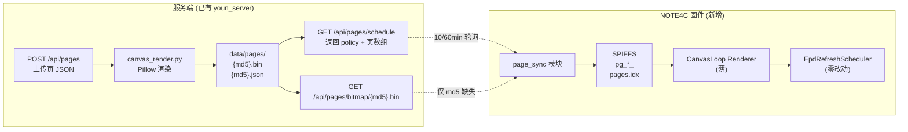

# Canvas Loop 设计

日期：2026-09-01
状态：草案，待用户审阅
作者：brainstorming 会话

## 概述

为 NOTE4C 4 色电子墨水屏设备引入"服务端编排画板页组"功能。设备本地零渲染
改动——服务端接收 Canvas JSON，渲染成 2bpp BWRY 位图，下发给设备；设备侧
通过新增的 page_sync 模块做 hash 增量同步、本地缓存、轮换显示。页组规模
1–5 页，每页时长独立配置（最短 10 分钟）。定时从服务端拉 schedule 并以
MD5 比对决定是否下载新位图，避免无意义网络流量和屏幕刷新。休眠窗口由
服务端 policy 下发，窗口内设备降频轮询且不刷屏。

## 背景与动机

- 设备侧现有 rawdraw 渲染管线是裸帧缓冲 + 手写 C++ 渲染器，没有 CSS
  /JS 引擎，无法直接运行 MindReset Canvas API 的 JSON 树
- 现有"图片推送"通道（photo_downloader + DisplayRaw4ColorImage）已具备
  服务端预渲染位图到设备的全部基础能力，但缺画板 DSL 与页组调度
- 设备 4 色屏 SSD2683 全屏刷新需 10 秒以上，wiki 官方资料无快速刷新
  模式；页时长下限按物理刷新时长×合理比值定为 10 分钟
- 现有相册轮播 gallery_slideshow_timer_ 只有 5/10/30 分钟单页固定档
  位，且相册内容由本地 SPIFFS 提供，不支持服务端下发任意画板内容

## 目标

- 服务端编排 1–5 页画板内容，每页内容为 Canvas JSON 树，服务端渲染成
  400×300 2bpp BWRY 位图
- 设备每 10 分钟向服务端拉一次 schedule；schedule MD5 不变则零动作
- 内容/时长/顺序任一变更触发增量下载，仅只下载 MD5 不同的位图
- 设备按各页 duration_minutes 自动轮换显示，到期切下一张
- 设备侧零渲染改动，仅新增 page_sync 模块和一个薄 renderer

## 非目标

- 不支持 Canvas API 完整规范：仅实现 div/span/img + 文本 + 固定尺寸 +
  4 色 + 圆角边框，不支持 `$for`/`$ifAny`/`{{get}}` 模板、不支持 z-index
  /3D transform / calc()，不支持 RTL、不支持动画
- 不替代现有相册页：相册功能与画板页组是两套独立子系统，画板页组占
  一个独立的 RawDrawPageId::CanvasLoop 槽位
- 不引入 OTA 机制变更：本次固件改动通过合并镜像刷写；OTA 流程沿用
  现有 scripts/release.py + 服务端 ota 模块
- 不修改 EpdRefreshScheduler：刷新管线零改动
- 不重做 wakeup / 深度休眠流程：休眠窗口内仅"不切页不刷屏 + 降频轮
  询"，Wi-Fi 保持连接

## 架构



### 职责划分

| 职责 | 归属 |
|---|---|
| 接收 Canvas JSON | 服务端 |
| 渲染为 2bpp BWRY 位图 | 服务端 |
| 计算内容 MD5 | 服务端 |
| schedule MD5 计算 | 服务端 |
| 休眠窗口配置 | 服务端 policy |
| 屏幕激活判定 (`screen_active`) | 服务端 |
| HTTP 轮询 schedule | 设备 |
| MD5 比对决定下载 | 设备（基于文件名 `pg_{md5前8}.bin`） |
| 位图本地 SPIFFS 缓存 | 设备 |
| 页时长计时与轮换 | 设备 |
| 切页时调用 DisplayRaw4ColorImage | 设备 |
| 休眠窗口内降频轮询 | 设备 |
| 休眠窗口内冻结页面（不切不刷） | 设备 |

## 服务端设计

#### Canvas 渲染器

文件：`server/youn_server/canvas_render.py`（新增）

支持的 Canvas 元素子集：

| Canvas API 特性 | 支持 | 说明 |
|---|---|---|
| `div` 嵌套 | 是 | flex-col / flex-row 布局 |
| `span` 内联 | 是 | 文本节点载体 |
| `img` | 是 | data URI / http(s) URL |
| `props.children` 字符串 | 是 | 文本内容 |
| `props.children` 单元素 | 是 | 嵌套 |
| `props.children` 元素数组 | 是 | 多子节点 |
| 固定尺寸 `w-[Npx]`/`h-[Npx]` | 是 | 像素直译 |
| `gap-[Npx]` | 是 | flex gap |
| `p-[Npx]`/`px-[Npx]`/`py-[Npx]` | 是 | padding |
| `m-[Npx]`/`mx-[Npx]`/`my-[Npx]` | 是 | margin |
| `flex-col`/`flex-row` | 是 | 布局方向 |
| `items-*`/`justify-*` | 是 | flex 对齐 |
| `bg-white/black/red/yellow` | 是 | 4 色背景 |
| `text-*` + 文本 | 是 | Pillow FreeType，中文字体 |
源 | | 78__xiaozhi-fonts |
| `font-bold`/`font-weight:bold` | 是 | 粗体 |
| `border` + `borderColor` | 是 | 1px 边框 |
| `rounded-[Npx]` | 是 | 圆角矩形 |
| `overflow:hidden` | 是 | 溢出裁剪 |
| `$for`/`$empty` | 否 | YAGNI，真需要时再加 |
| `$ifAny`/`$then`/`$else` | 否 | 同上 |
| `{{get inputData x}}` 模板 | 否 | 直接写死每页内容，不需要模板 |
| `flex-1` 自动伸缩 | 否 | 第一版固定尺寸 |
| `z-index`/3D transform/calc() | 否 | 硬件渲染管线无对应概念 |
| 任意 Tailwind 颜色 | 否 | 只支持 4 色 + 白/黑/红/黄 |
| CSS 动画/过渡 | 否 | EPD 静态显示 |

字体来源：复用 `firmware/components/78__xiaozhi-fonts/png/` 内已有字体，
转换为 Pillow 可用的 TTF/OTF（如果没有 .ttf，需用 fontTools 转换或
预渲染字体子集）。

抖动算法：复用 `image_conv._floyd_steinberg_palette`，针对 4 色 BWRY
palette。

输出：渲染后产出 `{md5}.bin`（30000 字节，2bpp BWRY）+ `{md5}.json`
（`{"name", "rendered_at", "source_sha256"}`）。

幂等性：相同输入必产相同 MD5。这是设备"MD5 比对一致后不刷新"需求的
基础。

#### API 端点

挂入现有 `app.py`，路由前缀 `/api/pages`：

| 方法 | | | 鉴权 |
|---|---|---|---|
| POST | `/api/pages` | 创建/更新一页： `{name, canvas_json, duration_minutes, order}` | OPERATOR_TOKEN |
| GET | `/api/pages` | 列出全部页 | OPERATOR_TOKEN |
| DELETE | `/api/pages/{name}` | 删页 | OPERATOR_TOKEN |
| GET | `/api/pages/schedule` | 设备用，**无鉴权** | — |
| GET | `/api/pages/bitmap/{md5}.bin` | 设备用，**无鉴权** | — |

##### GET /api/pages/schedule 响应

```json
{
  "schedule_md5": "a3f9...88",
  "server_time": "2026-09-01T23:30:00+08:00",
  "policy": {
    "sleep_window": {"start": "00:00", "end": "06:00", "tz": "Asia/Shanghai"},
    "poll_interval_minutes": 10,
    "sleep_poll_interval_minutes": 60,
    "min_page_duration_minutes": 10
  },
  "pages": [
    {"md5": "b12...", "duration_minutes": 10, "order": 0, "name": "天气"},
    {"md5": "c34...", "duration_minutes": 30, "order": 1, "name": "日历"}
  ],
  "screen_active": true
}
```

- `schedule_md5`：所有 `(md5, duration_minutes, order)` 排序后拼接哈希
- `policy.sleep_window`：默认 `00:00-06:00 Asia/Shanghai`，可在 `.env`
  配 `CANVAS_SLEEP_START`/`CANVAS_SLEEP_END`/`CANVAS_TIMEZONE`
- `policy.poll_interval_minutes`：默认 10
- `policy.sleep_poll_interval_minutes`：默认 60
- `policy.min_page_duration_minutes`：默认 10，设备创建页时强制校验
  `duration_minutes >= min_page_duration_minutes`
- `screen_active`：服务端即时计算，设备只看这个布尔值
- 空 schedule 返回 `"pages": []`，设备清空轮换表

##### GET /api/pages/bitmap/{md5}.bin

返回 30000 字节原始 2bpp BWRY 流，`Content-Type: application/octet-stream`。
内容寻址，MD5 错误 → 404。

#### 渲染失败处理

- 元素类型不支持 `→ 400`，路径格式学 Canvas API：`path:
  windowData.default[0].props.children[0].type`
- 模板语法 (`{{get}}` / `$for` / `$ifAny`) 出现 `→ 400` 明确报错
- Pillow 渲染中途失败 `→ 500`，页不入库，schedule 不更新，坏页永远不
  污染设备

#### 文件落盘布局

```
server/data/
├── pages/
│  ├── {md5}.bin          # 30000 字节 2bpp BWRY
│  ├── {md5}.json         # 元数据
│  └── schedule.json      # 当前生效 schedule（含 schedule_md5）
├── devices.db
├── images/               # 已有
├── firmware/             # 已有
└── uploads/              # 已有
```

#### 服务端改动清单

| 文件 | 操作 |
|---|---|
| `server/youn_server/canvas_render.py` | 新增 |
| `server/youn_server/app.py` | 增加 5 个路由 |
| `server/youn_server/pages.py` | 新增（页存储 CRUD） |
| `server/youn_server/config.py` | 增加 4 个 policy 字段 |
| `server/.env.example` | 增加 CANVAS_* 配置 |
| `server/DEPLOY.md` | 增加 Canvas 页组管理章节 |
| `server/requirements.txt` | 增加 `Pillow`（已有）+ 字体处理依赖如需 |

## 固件设计

仅一个新增模块 + 一个薄 renderer + 一处页面注册，其余零改动。

### 新增 `firmware/main/common/page_sync.{h,cc}`（约 300 行）

参照 `photo_downloader` 的 HTTP 客户端封装与 `gallery_slideshow_timer_`
的 esp_timer 写法。

状态：

```cpp
struct PageCacheEntry {
  char md5[33];        // hex md5
  uint16_t order;
  uint32_t duration_seconds;
  bool on_disk;        // bitmap 已下载
};

struct PageSyncState {
  char server_url[128];  // 配置的服务端 base url
  char current_schedule_md5[33];
  std::vector<PageCacheEntry> pages;  // 排序后
  uint32_t current_playing_index;
  uint64_t current_page_started_at;   // esp_timer_get_time() / 1e6
  bool screen_active;                  // 服务端最新判定
  esp_timer_handle_t poll_timer;
  uint32_t poll_interval_seconds;     // 根据 screen_active 切换 10min/60min
  // SPIFFS 索引文件 /spiffs/pages.idx 持久化 pages[] 和 current_playing_index
};
```

行为：

1. 启动：读 `pages.idx`，恢复上次状态；若无，初始化为空
2. `page_sync_init(server_url)`：启动 esp_timer，每 poll_interval 触发
   `_poll_tick()`
4. `poll_tick`（异步 task）：
   a. HTTP GET `{server_url}/api/pages/schedule`
   b. 失败 → 指数退避（10/20/40/80/160 秒封顶），不切页不刷屏
   c. `schedule_md5` 与本地一致 → return
   d. 不一致 → 解析 policy，更新 `poll_interval_seconds`、
      `screen_active`、`min_page_duration_minutes`
   e. 解析 pages[]：
      - 旧 schedule 中不再出现的页 → 删除 SPIFFS `pg_{old_md5前8}.bin`
      - 新出现的页或 md5 不同的页 → 下载位图
   f. 持久化 `pages.idx`
   g. 发消息给 UI 层："页组已更新"
5. `canvas_loop_renderer` 每秒查询：`now - current_page_started_at >
   duration_seconds` → 调 `advance_to_next()`
6. `advance_to_next()`：
   - 若 `!screen_active` → 冻结，不推进
   - 否则 `current_playing_index = (current_playing_index + 1) %
     pages.size()`
   - 调 `lcd_->DisplayRaw4ColorImage(spiffs_data, 30000, 400, 300)`
   - 触发 full refresh：`force_full_refresh_ = true; sm_kick(kick_ms)`
   - `current_page_started_at = now`

### 新增 CanvasLoop renderer

文件：`firmware/main/ui/renderers/rawdraw/canvas_loop_renderer.{h,cc}`
（约 80 行）

类：`rawdraw::CanvasLoopRenderer : public PageRenderer`

职责：
- `Init`：从 SPISync 读当前页位图指针和尺寸
- `Render`：直接把位图写入 framebuffer（已有 photo_detail_renderer
  同样模式），声明 full refresh
- `HandleInput`：透传到页调度器，不处理

### `RawDrawPageId` 新增

``` cpp
 CanvasLoop = 18,
```

插入在 `Count` 之前。

### UI Manager 接线

`rawdraw_ui_manager.cc` 改动 ~50 行：
- 加 `canvas_loop_renderer_` 成员
- 初始化时 `canvas_loop_renderer_ = std::make_unique<CanvasLoopRenderer>()`
- 加 `canvas_loop_renderer_->Init(width, height)`
- `SwitchPage(CanvasLoop)` 时 `page_sync_resume()`（如果有暂停）
- 退出 CanvasLoop 时 `page_sync_suspend()`（仍轮询，但不切页）

### 服务器 URL 配置

- 编译期默认值：`firmware/main/boards/zectrix-s3-epaper-4.2/config.h` 加
  `#define PAGE_SYNC_SERVER_URL "https://your-server.example.com"`
- 运行时：用户在"设置"页（已有）输入 URL URL 通过 BOOT + 长按上键进入
  子页面，参考现有 `settings_page.cc` 的模式
- URL 持久化：`NVS namespace "pagesync"`，key `"url"`

### 固件改动清单

| 文件 | 操作 |
|---|---|
| `firmware/main/common/page_sync.h` | 新增 |
| `firmware/main/common/page_sync.cc` | 新增 |
| `firmware/main/ui/renderers/rawdraw/canvas_loop_renderer.h` | 新增 |
| `firmware/main/ui/renderers/rawdraw/canvas_loop_renderer.cc` | 新增 |
| `firmware/main/ui/rawdraw_ui_manager.h` | 加 `CanvasLoop` 枚举值 + renderer 指针 |
| `firmware/main/ui/rawdraw_ui_manager.cc` | 加 renderer 初始化 + 页面切换逻辑 |
| `firmware/main/CMakeLists.txt` | SOURCES 增加 `page_sync.cc` + `canvas_loop_renderer.cc` |
| `firmware/main/boards/zectrix-s3-epaper-4.2/config.h` | 加 PAGE_SYNC_SERVER_URL 默认值 |

## 数据契约

#### 服务端 → 设备 schedule 响应

参见上文 `GET /api/pages/schedule 响应` 章节。

#### 设备持久化格式 `/spiffs/pages.idx`

```
binary header:
  magic: "PAGE" (4 bytes)
  version: uint8 = 1
  count: uint8
  reserved: 8 bytes (zeros)
entries (each 48 bytes):
  md5_hex: char[33]    // 含 \0
  duration_seconds: uint32
  order: uint16
  on_disk: uint8 (0/1)
footer:
  current_playing_index: uint8
  schedule_md5_hex: char[33]    // 含 \0
```

固定 256 字节 + 48*N，最多 5 页 → 256+240 = 496 字节。

## 错误处理

| 场景 | 行为 |
|---|---|
| 服务端 schedule 拉取失败 | 指数退避（10/20/40/80/160 秒封顶），本地缓存继续轮换 |
| 位图下载失败 | 该页标记 missing，跳过它继续轮换其余页，下个周期重试 |
| SPIFFS 满 | 按最旧且不在当前 schedule 的顺序清理 |
| 服务端 schedule MD5 一致 | 零动作 |
| 服务端页面内容非法 JSON | 400 + 路径报错，schedule 不更新 |
| 设备时钟漂移 | 不依赖本地时钟做决策，screen_active 由服务端判定 |
| OTA 与 page_sync 同时运行 | 互不干扰——page_sync 走 HTTP，OTA 走单独流程 |

## 测试

#### 服务端

- pytest + Pillow 像素比对：给定 JSON → 渲染 → 字节与 MD5 稳定；非法
  元素树 → 400；不支持项 → 报错
- pytest + httpx：schedule MD5 跨页内容/时长/顺序变化都变；纯时间无
  关修改不变；空 schedule → 空 pages
- 渲染性能：单页 < 2 秒（典型尺寸），5 页连续渲染 < 10 秒

#### 设备

- 设备仿真或真机：schedule 不变不刷屏；schedule 变但页 MD5 都已存在
  → 不下载字节；schedule 变且有新页 → 增量下载；page 缺失时跳过；
  SPIFFS 满时 LRU 清理
- 端到端：服务侧 schedule 变更 → 设备 10 分钟内下载新页 → 下次切页
  显示新内容；休眠窗口内 → 降频轮询 + 不刷屏；窗口结束 → 第一个
  轮询周期恢复 10 分钟节奏并刷出积压内容

#### 回归

- 相册页、所有 14 个 RawDraw 页面、对话、TTS、Wi-Fi 配网、AP 传图、
  OTA、语音唤醒——这些路径不被 CanvasLoop 引入影响
- BLE 传图、photo_downloader 现有逻辑不受 page_sync 调度干扰（独立
  SPIFFS 命名空间 `pg_*` 前缀）
- 刷新管线 EpdRefreshScheduler 零改动
- 设备启动顺序：page_sync 在 photo_sync 之后初始化，允许独立失败

## 风险与权衡

| 风险 | 缓解 |
|---|---|
| SSD2683 无快速刷新模式，每页 10 秒+ 全屏闪烁不可避免 | 页时长下限设为 10 分钟，刷新占比 < 2% |
| 字体子集化工作量大 | 第一版复用现有字体文件，不子集化；接受包体增大 |
| $for / {{get}} 模板缺失导致动态数据展示受限 | 服务端侧可在 POST 前用 Python 模板预渲染 → 静态 JSON，绕过 |
| schedule MD5 跨页数变化时设备端整页组重建 | 设备端 pages[] 是有序数组，差分计算，逻辑简单 |
| 服务端时钟与服务端时钟不在时差 | 设备只看 screen_active 布尔，不需本地时区换算 |
| 休眠窗口内断网导致醒来无内容 | 设备在休眠前保证已下载至少一帧；policy 加 `wake_buffer_minutes: 1` 提前下载 |
| 双击上键切出 CanvasLoop 后 page_sync 暂停但仍轮询 | 暂停不暂停都轮询，区别只在是否切页；改名为 suspend_advance |

## 未决问题（实施时定）

- 服务端启动时预渲染？或懒渲染（第一次 GET schedule 才渲染）？
  倾向懒渲染 + LRU 缓存，节省启动时间
- 字体子集化是否必要？取决于第一版功能取舍
- schedule 限频：服务端是否限制 deviceId 的 schedule 拉取频率（防
  滥用）？第一版不做，靠网络层限流

## 实施顺序

本次只先做服务端，机器未插电脑。

1. 服务端：
   - `pages.py` 存储模块
   - `canvas_render.py` Pillow 渲染器
   - `app.py` 加 5 个路由
   - `config.py` 加 4 个 policy 字段
   - `.env.example` 加 CANVAS_*
   - pytest 覆盖渲染器和 API
   - 在你机器上跑端到端：上传页定义 → 渲染 → 模拟设备 GET schedule
     → 模拟设备 GET bitmap
2. 设备插电脑后：
   - 按改动清单写固件代码
   - idf.py build + merge_bin 烧录
   - 真机端到端