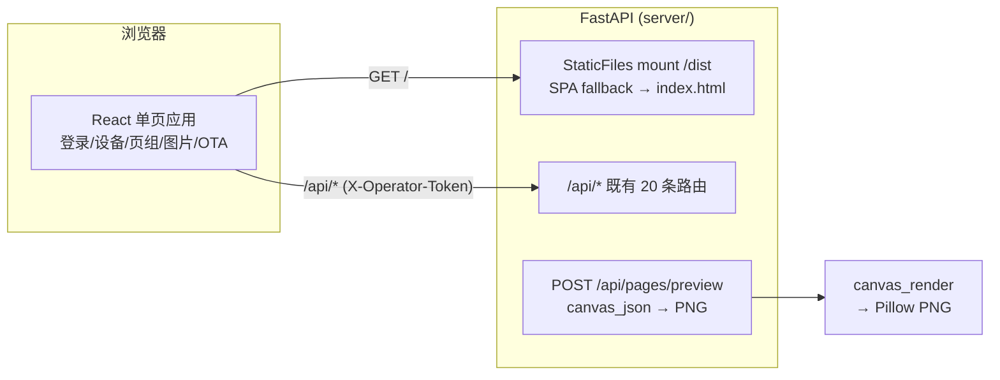

# Web 管理界面设计

日期：2026-09-02
状态：已批准（§1–§4 逐节确认）
前置：`docs/superpowers/specs/2026-09-01-canvas-loop-design.md`
      `docs/superpowers/specs/2026-09-02-device-pairing-auth-design.md`

## 概述

为服务端新增浏览器 Web 管理界面，覆盖设备管理+配对、Canvas 页组管理+预览、
图片上传推送、OTA 管理。前端采用 React + Vite，构建产物由 FastAPI StaticFiles
直接托管，访问 `http://host:9002/` 即管理界面。鉴权用 OPERATOR_TOKEN 登录页 +
localStorage + `X-Operator-Token` 头。

## 背景与动机

- 服务端现有 20 条纯 JSON API（设备/配对/页组/图片/OTA），无任何 Web UI，
  只能 curl 调用
- 配对流程需要 operator 输入 6 位码，目前只能 curl，不友好
- Canvas 页组管理、图片推送、OTA 都缺图形界面
- FastAPI 自带 Swagger UI 只适合 API 调试，不适合日常管理

## 目标

- 浏览器访问 `http://host:9002/` 即管理界面（单端口，无反代）
- 设备管理 + 配对确认（图形化输入 6 位码）
- Canvas 页组 CRUD + 位图实时预览
- 图片上传 + 2bpp 转换预览 + 推送
- OTA 固件上传 + 版本列表
- 登录页输入 OPERATOR_TOKEN，请求带鉴权头

## 非目标

- 不做前端实时推送（设备状态变化需手动刷新；后续可加 WebSocket）
- 不做复杂 Canvas 可视化编辑器（JSON textarea + 位图预览足够）
- 不做多用户/角色权限（单 operator token）
- 不做前端测试框架（build 通过 + 浏览器冒烟即可）

## 架构



- 前端 `frontend/`：React 18 + Vite + react-router-dom，无 UI 框架
- 后端：`app.py` 加 `StaticFiles` 挂载 `frontend/dist/` 到 `/`，SPA fallback
- 鉴权：登录页 → localStorage → fetch 带 `X-Operator-Token` 头
- 开发：`npm run dev` (5173) + Vite proxy `/api` → `:9002`；生产：`npm run build` → FastAPI 托管

## 前端设计

### 页面路由

| 页面 | 路由 | 功能 |
|---|---|---|
| 登录 | `/login` | 输入 token → localStorage |
| 设备管理 | `/devices` | 列表 + 配对 + 信任/吊销 |
| 页组管理 | `/pages` | CRUD + Canvas 预览 |
| 图片推送 | `/images` | 上传 + 2bpp 预览 + 推送 |
| OTA | `/ota` | 固件上传 + 版本列表 |

### 目录结构

```
frontend/
├── package.json
├── vite.config.js        # react 插件 + proxy /api → 9002
├── index.html
└── src/
    ├── main.jsx          # 入口 + Router
    ├── App.jsx           # 布局 + 路由表 + 登录守卫
    ├── api.js            # fetch 封装（带 token 头、错误处理）
    ├── auth.js           # token localStorage 读写
    ├── pages/
    │   ├── Login.jsx
    │   ├── Devices.jsx   # 列表 + 配对流程
    │   ├── Pages.jsx     # 页组 CRUD + Canvas 预览
    │   ├── Images.jsx    # 图片上传推送
    │   └── Ota.jsx
    └── styles.css
```

### 关键交互

- **配对**：点"配对"→ `pair-start` → 显示"等待设备屏显码"→ 输入 6 位 → `pair-confirm`
- **Canvas 预览**：textarea 编辑 JSON → 点"预览"→ `POST /api/pages/preview` → 显示 PNG
- **图片推送**：文件选择 → 原图预览 → 格式选择 → 目标设备下拉 → 推送
- **OTA**：文件 + 版本 + 通道 + 上传

## 服务端改动

| 文件 | 操作 |
|---|---|
| `youn_server/app.py` | StaticFiles 挂载 `frontend/dist`；SPA fallback；`/api/pages/preview` 路由 |
| `youn_server/canvas_render.py` | 加 `render_canvas_to_png(canvas_json) -> bytes` |
| `youn_server/pages.py` | 无改动 |
| `tests/test_preview.py` | preview 端点测试 |

### 静态托管

```python
from fastapi.staticfiles import StaticFiles
from pathlib import Path
dist = Path(__file__).resolve().parents[2] / "frontend" / "dist"
if dist.exists():
    app.mount("/", StaticFiles(directory=dist, html=True), name="spa")
```

SPA fallback：Vite 构建用 `history` 路由需要 `index.html` fallback——用
StaticFiles `html=True` 只能服务静态文件，深路由（`/devices`）刷新会 404。
方案：加一个 catch-all 路由 `GET /{full_path:path}` 返回 `index.html`（若
文件存在则返回文件，否则 fallback）。确认用 `connect` 方式或简单
catch-all。

### preview 端点

```
POST /api/pages/preview
body: {"canvas_json": {...}}
resp: image/png (400×300 预览位图)
```

复用 `canvas_render.render_canvas_to_bitmap` → Pillow 转 PNG → 返回。

## 测试

- 前端：`npm run build` 通过；`npm run dev` 浏览器冒烟各页
- 后端：`GET /` 返回 index.html；静态资源可加载；preview 端点 pytest（合法 JSON → 200 PNG；非法 → 400）
- 端到端：浏览器登录 → 建页 → 预览 → 保存 → 设备拉新页

## 实施顺序

1. 服务端：preview 端点 + 静态托管 + pytest
2. 前端脚手架：Vite + React + 路由 + api.js + 登录页
3. 前端各页：设备/页组/图片/OTA
4. 联调：build → 托管 → 浏览器全流程
