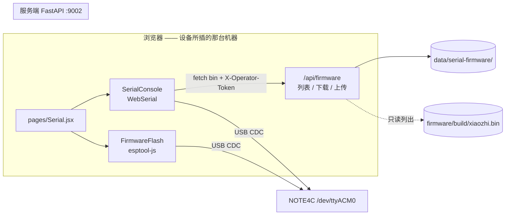
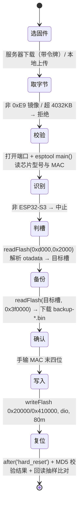

# 串口控制台与固件刷写（设备管理后台）设计

日期：2026-09-16
状态：草案，待用户审阅
作者：brainstorming 会话

## 概述

在设备管理后台（`frontend/` SPA）新增「串口 / 固件」页：**用桌面浏览器经
WebSerial 直连本机串口**，读 NOTE4C 的设备日志，并用 `esptool-js`（Espressif
官方 JS 版 esptool）就地把固件刷进 `0x20000` 活动槽。

串口**不经过服务端**：服务端只做「固件仓库」（列清单 / 下载 / 上传），
因此**零串口代码、零新增 Python 依赖**，公网上也**不会多出任何固件写入
API**。设备插在哪台机器，就在那台机器上用浏览器打开后台即可——这正是
「设备可能插在别的机器上」的解法。

本次改动**不涉及设备固件**（零固件改动）。

## 背景与动机

- 现状：刷机 = SSH 到服务器 → `idf.py build` → `python -m esptool write-flash
  0x20000 firmware/build/xiaozhi.bin`；看日志 = 本机跑一次性抓取脚本。
  两者都要求在**设备所插的那台机器**上有 shell。
- 设备可能插在任意一台机器上（家里、现场、笔记本），而这些机器不一定
  有 ESP-IDF 环境或 shell 权限。
- 浏览器侧方案（WebSerial + esptool-js）已被官方与社区广泛使用
  （ESP Web Tools 即此路线），桌面 Chrome/Edge 89+、Firefox 151+ 可用。

### 已实测的硬约束（来自本项目真机教训）

| 约束 | 证据 |
|---|---|
| 打开 `/dev/ttyACM0` **即复位芯片** | 本项目多次实测；本会话每次抓取都伴随一次复位 |
| 两个读者同时开同一端口 = 幽灵复位循环 | `esp32s3-usbserial-flash-and-observe-traps`；本会话已踩 |
| USB 串口控制台**开着**时设备**不进深睡** | 该设备深睡会主动断开 USB-CDC |
| OTA 更新后 `otadata` 指向 `ota_1`，此时刷 `0x20000` **不生效** | 分区表实测 `ota_0@0x20000` / `ota_1@0x410000`；「刷了但没变」类问题的根因 |
| 应用分区上限 `0x3f0000`（4032 KB） | 从构建出的 `partition-table.bin` 解析，非抄 csv |

## 目标

- 浏览器打开后台 → 点选本机串口 → 实时看设备日志（含中文，不得乱码）
- 从后台选一个固件（服务器已有产物，或本地上传），经确认后刷入设备
- 刷写前自动备份将被覆盖的分区、刷后校验、全程可见进度与日志
- 服务端只提供固件仓库；**不引入串口/工具链依赖**，不新增公网写入面
- 现有 SSH 手刷流程完全不受影响

## 非目标

- **不做服务端串口桥 / 可安装代理**：无法覆盖「设备插在别的机器上」，
  且会在公网增加固件写入链路。若日后要「手机远程刷」，另立项目。
- **不做手机端**：Chrome Android 的 WebSerial 仅支持蓝牙 RFCOMM 串口，
  USB 串口不可用；iOS Safari 完全不支持。
- **不做后台构建**：构建仍由人在服务器 `idf.py build`（需注入
  `DEVICE_MASTER_KEY`，漏了会造出永远配不上对的设备）。
- **不做串口输入 / 命令行**：固件无控制台协议，只读 + 复位按钮。
- **不改 OTA 频道**：上传的调试件绝不进 `data/firmware/`。
- **不改设备固件**。

## 架构



### 职责划分

| 职责 | 归属 |
|---|---|
| 打开/关闭本机串口、读字节流、解码分行、渲染日志 | 浏览器 |
| 识别芯片、读 otadata、备份、写 flash、校验 | 浏览器（esptool-js） |
| 固件清单、下载、上传、SHA-256、路径防护 | 服务端 |
| 操作员鉴权（fail-closed） | 服务端 |

### 三条必须守住的不变量

1. **`data/serial-firmware/` 与 OTA 的 `data/firmware/` 严格分离**：否则
   上传的调试件会被设备经 `/api/ota/check` 当正式更新拉走并自动刷。
2. **同一时刻只有一个串口持有者**：WebSerial 端口一旦被某标签页打开，
   本机 `idf.py monitor`、esptool、其他标签页全部打不开（反之亦然）。
   UI 必须把「端口被占用」作为一等失败面。
3. **绝不自动重连串口**：打开即复位，自动重开会变成幽灵复位循环。

## 组件与接口

### 服务端

`server/youn_server/config.py` 新增设置（照既有 `firmware_dir/uploads_dir`
写法，并加入 `resolve_paths` 的字段元组与 mkdir 循环）：

```python
serial_firmware_dir: Path = Field(default=Path("./data/serial-firmware"))
```

`server/youn_server/app.py` 在 `create_app()` 内新增一节
`# ── Serial firmware (operator) ──`，位置在 SPA 托管与 MCP 挂载**之前**
（MCP 根 mount 必须保持最后）。

新增严格鉴权辅助函数（现有 `_require_operator` 在令牌为空时**放行**，
对固件读写不可接受）：

```python
def _require_operator_strict(request: Request) -> None:
    if not _operator_token():
        raise HTTPException(status_code=503, detail="operator token not configured")
    _require_operator(request)   # 令牌存在时按既有语义比较，失配 401
```

| 端点 | 鉴权 | 行为 |
|---|---|---|
| `GET /api/firmware` | strict | 返回 `{"items":[...]}`；来源 A = `firmware/build/xiaozhi.bin`（存在才列），来源 B = `data/serial-firmware/*.bin` |
| `GET /api/firmware/{id}/download` | strict | 返回 `application/octet-stream`，附 `Content-Length` 与 `X-SHA256` |
| `POST /api/firmware` | strict | `multipart/form-data` 字段 `file`；校验通过则落盘并返回新条目 |

条目形状（`id` 为不透明标识，下载时**只在允许的两个根目录内解析**，
不接受任意路径，写法照 `ota.py` 既有的 `.resolve()` 父目录校验）：

```json
{
  "id": "build:xiaozhi.bin",
  "name": "xiaozhi.bin",
  "source": "build",
  "size": 2890400,
  "mtime": 1757983512.0,
  "sha256": "…",
  "image_ok": true            // 首字节 == 0xE9（上传时校验；未通过的文件不入库）
}
```

上传校验（任一不过即 400，且**不落盘**）：

1. 首字节 == `0xE9`（ESP 镜像头）；否则「这不是 ESP 应用镜像」
2. 长度 ≤ `0x3f0000`（4032 KB，应用分区实际大小）；否则明示超限
3. 文件名净化后再拼接（照 `ota.py` 的 `_safe_filename` 语义）
4. 落盘名 `serial-<UTC 时间戳>-<净化名>.bin`，同目录写 `.sha256` 伴随文件

不做刷写结果回传端点（YAGNI）：下载行为已由 uvicorn access log 记录，
刷写细节由浏览器侧日志与备份文件承载。

### 前端

沿用既有约定：页面放 `frontend/src/pages/`，非页面组件放 `frontend/src/`
根（与 `CanvasEditor.jsx` 同级），请求走 `api.js`（`BASE='/api'`，
`X-Operator-Token` 头来自 `auth.js` 的 `youn_operator_token`）。

| 文件 | 职责 |
|---|---|
| `src/pages/Serial.jsx` | 页面壳：两个页签（监视 / 刷写）、共享「当前端口」状态 |
| `src/SerialConsole.jsx` | 打开/关闭端口、字节流→文本、ring buffer、渲染与交互 |
| `src/FirmwareFlash.jsx` | 固件清单与上传、备份、确认、写入、结果 |

**路由注册必须两处同时改**：`src/App.jsx` 的 `<Route>` 与
`app.py` 中显式的 index 路由列表（`app.py:750-753`，漏一处刷新 404）。

`esptool-js` 用**动态 `import()`** 懒加载，避免进入首屏 bundle。

## 详细行为

### A. 日志读取管线

| 环节 | 做法 | 理由 |
|---|---|---|
| 打开 | `navigator.serial.requestPort()`（需用户手势）→ `port.open({baudRate})` | 打开会让 DTR/RTS 抖动 ⇒ 设备复位一次；按钮文案写「打开并复位」 |
| 读 | `port.readable.getReader()` 循环 `read()` | — |
| 解码 | `new TextDecoder('utf-8', {fatal:false})` 且 **`{stream:true}`** | 一个中文字可能被拆进两个 USB 包，不加 stream 会乱码 |
| 分行 | 攒 `pending`；遇 `\n` 出栈一行；孤立 `\r` 也 flush；剥离 ANSI `\x1b\[[0-9;]*m` 与其余控制字符（保留 `\t`） | 进度行用 `\r` 刷新；`CONFIG_LOG_COLORS` 可能带色码 |
| 渲染 | 单个 `<pre>`，`textContent` 设为尾部 N 行，用 `requestAnimationFrame` 合并到 ~100 ms 一次 | 每行一个 DOM 节点在高频日志下会卡死；单 `<pre>` 免费获得原生选中/复制 |

缓冲与交互：

- ring buffer 上限 **5000 行 / 2 MB**（先到者为准），溢出丢最旧；下载的
  `.log` 头部标注是否发生过截断
- 自动滚动；用户上滑则停止跟随并显示「回到底部」
- **「暂停」= 停止渲染，不是停止读取**：读循环始终运行，否则 USB 缓冲
  溢出会阻塞设备侧写日志
- 清屏 / 复制 / 下载 `.log` / 子串过滤框 / 可选每行 `[HH:MM:SS.mmm]`
  接收时间戳（默认关）
- 波特率默认 115200，可选 9600–921600；**改波特率会重开端口 ⇒ 再复位一次**
- 独立「复位设备」按钮；`getPorts()` 列出本页已授权端口供一键重连（仍需手势）
- 提示语必须写明：**监视期间设备不会进深睡，关闭本页即恢复**

关闭顺序：`reader.cancel()` → `releaseLock()` → `port.close()`。

### B. 刷写状态机



**活动槽判定**（本次最重要的正确性点）：

1. `readFlash(0xd000, 0x2000)` 读 otadata；全 `0xFF` ⇒ 活动槽 = `ota_0@0x20000`
   （擦除态 bootloader 回落到 ota_0）
2. 存在有效条目 ⇒ 按 ESP-IDF `esp_ota_select_entry_t`（32 字节：`ota_seq`、
   `seq_label[20]`、`ota_state`、`crc`）解析并推导槽位
3. 若监视页签此前看到过 boot log 的 `Loaded app from partition at offset 0x…`，
   用它对账；不一致则**以日志为准并提示**
4. 解析结果是**确认框里的可见字段**，并提供手动覆盖下拉（`0x20000` / `0x410000`）
5. 解析不了 ⇒ 默认 `ota_0` 且带警告

**门禁（按已确认的强度）**：

> 修订（2026-09-16，用户指示）：把「手输设备 MAC 末四位」换成「勾选已核对目标槽
> 与固件」。MAC 仍由 `chip.readMac()` 读出并显示在页面上与日志里，只是不再作为
> 强制校验项。


- 默认只写活动槽的应用分区；`bootloader` / 分区表 / `nvs` **一律不碰**
- 刷前自动读回该槽全量（4032 KB）并下载为 `backup-<MAC>-<slot>-<时间>.bin`
  （默认开启，可关但需二次勾选）
- 确认框列出：芯片型号、MAC、目标偏移与槽名（含判定依据）、文件名与
  SHA-256、备份文件名；开始前**勾选「我已核对目标槽与固件」**（2026-09-16 用户指示：原则上不验证 MAC 地址 —— MAC 仍然显示供人工核对，但不作强制校验）
- 刷后：esptool 自带 MD5 校验 + 从目标偏移回读前 256 B 与文件头逐字节比对
- 高级折叠项（默认关，需额外确认）：「完整镜像」需 `merged-binary.bin`
  （含 bootloader/分区表，额外备份 `bl-pt-otadata.bin`）、「重置启动选择回
  ota_0」（先备份 otadata 再写全 `0xFF`）

**刷写期间**：挂 `beforeunload` 拦截关页；UI 明写「完成前不要关页面、不要
拔线」；端口丢失时提示「可能处于半写状态，勿断电，用备份回滚」。

### C. 端口生命周期

- 打开与刷写互斥：点「刷写」自动关闭监视；刷完**不自动重开**监视
- `navigator.serial` 的 `disconnect` 事件 ⇒ 标记「设备已断开（可能去了深睡）」
  + 一个**手动**「重新连接」按钮
- 无 WebSerial（Safari / 手机 / 非安全上下文）⇒ 页面直接给出「请用桌面
  Chrome/Edge 89+ 或 Firefox 151+ 打开」，而不是按钮点了没反应
- dev 说明：`http://localhost:5173` 是安全上下文可用；`http://<局域网 IP>`
  不可用（`navigator.serial` 直接不存在），跨机器测试必须走 HTTPS 域名

## 安全

- 三个新端点全部 **fail-closed**：`OPERATOR_TOKEN` 未配置 ⇒ 503，不提供
  列表/下载/上传
- 公网新增面仅为「列固件 / 下固件 / 传固件（带令牌）」；**没有**固件写入
  或串口控制的公网 API
- 路径穿越：`id` 只允许解析到两个白名单根目录之内（照 `ota.py` 既有写法）
- 上传内容按不可信处理：大小、镜像头、文件名三重校验；上传件永不进 OTA
  频道；`*.bin` 已在 `.gitignore`，不会进仓库
- CSRF 面低：需自定义请求头 `X-Operator-Token`，同源 fetch

## 错误处理与失败面

| 失败 | UI 行为 |
|---|---|
| 无 WebSerial（Safari / 手机 / 非安全上下文） | 页面改为静态提示，按钮置灰并写明用桌面 Chrome/Edge 89+、Firefox 151+
| 端口被占用 / 打不开 | 明示「本机另一个程序（idf.py monitor / esptool）占着它」 |
| 用户在选择器里取消 | 静默回到空闲，不报错 |
| 设备中途断开 | 「设备已断开」，不自动重连，提供备份回滚指引 |
| 芯片不是 ESP32-S3 | 在 `main()` 后即中止，未写入任何字节 |
| 文件非 ESP 镜像 / 超限 | 取字节阶段即拒绝，不打开端口 |
| 刷写中校验失败 | 保留日志，指向备份文件，明确「勿断电」 |

## 测试与验收

### 服务端（pytest，随提交，**不需要设备**）

`server/tests/test_firmware_api.py`：

- 无令牌 ⇒ 401；`OPERATOR_TOKEN` 置空 ⇒ 503（fail-closed 回归）
- 列表包含构建产物条目且 `size`/`sha256` 与文件一致
- 下载字节与 `X-SHA256` 一致；`id` 含 `../` 或绝对路径 ⇒ 拒绝
- 上传合法镜像 ⇒ 200 且落盘在 `data/serial-firmware/`（**断言不在
  `data/firmware/`**）
- 坏 magic ⇒ 400；超 `0x3f0000` ⇒ 400；文件名含 `../` ⇒ 净化后仍在白名单目录内

### 前端自动化边界（诚实声明）

WebSerial 的 `requestPort()` 必须由人点选端口，Playwright **无法**完成真实
刷写。可自动化的是：桩掉 `navigator.serial` 后的「不支持」降级提示、桩掉
`esptool-js` 后的刷写状态机（含取消、失败、活动槽判定分支）、日志管线
（用假字节流注入验证**分行/中文解码/截断规则**——这是纯函数，可直接单测）。
**真实 USB 字节流必须由人在设备旁点一次**，不作为 CI 断言。

### 真机人工验收（交付门槛）

1. 在设备所插机器上用桌面 Chrome 打开 `https://note-device.1024.center:31443/serial`
2. 点「打开并复位」⇒ 看到从头的启动日志（含 `EPD bring-up`），中文不乱码
3. 拔线 ⇒ 显示「设备已断开」且**不**自动重连；点手动重连 ⇒ 再次从头
4. 选 `firmware/build/xiaozhi.bin` ⇒ 确认框显示芯片 ESP32-S3、MAC、目标槽
   与偏移、SHA-256 ⇒ 手输 MAC 末四位 ⇒ 备份下载完成 ⇒ 写入进度到 100%
5. 刷后 MD5 校验通过、回读头 256 B 比对一致
6. 设备重启后日志中能看到本次改动的特征串（证明跑的是新代码）

## 部署

- 前端新增依赖 `esptool-js` ⇒ `npm run build`（产物由 FastAPI 托管）+ 重启
  `systemctl --user restart youn-ink-server`
- 服务端**无依赖变更**（不新增 pyserial / esptool）
- 新增目录 `data/serial-firmware/` 由 `resolve_paths` 自动创建

## 已知风险与未验证项

| 项 | 状态 | 处置 |
|---|---|---|
| `otadata` 槽位推导规则 | **未在真机验证**（验证时设备已被拔走） | 解析结果在确认框可见且可手动覆盖；实现时用真机对照 boot log 的 `Loaded app from partition at offset` 定案 |
| WebSerial 在 Firefox 151+ 与本设备的实际表现 | 未验证 | 文档只说 Chrome/Edge 可用；Firefox 列为「理论可用」，验收以 Chrome 为准 |
| esptool-js 与 USB-Serial-JTAG 的复位时序 | 未验证 | 首次真机刷写即为验证；失败时回退到「先手动进下载模式」的既有办法 |
| 两标签页互斥 | 依赖浏览器实现 | UI 把「端口忙」当归一失败面处理 |

## 开放问题

无（分类为架构级，四节设计均已确认）。
